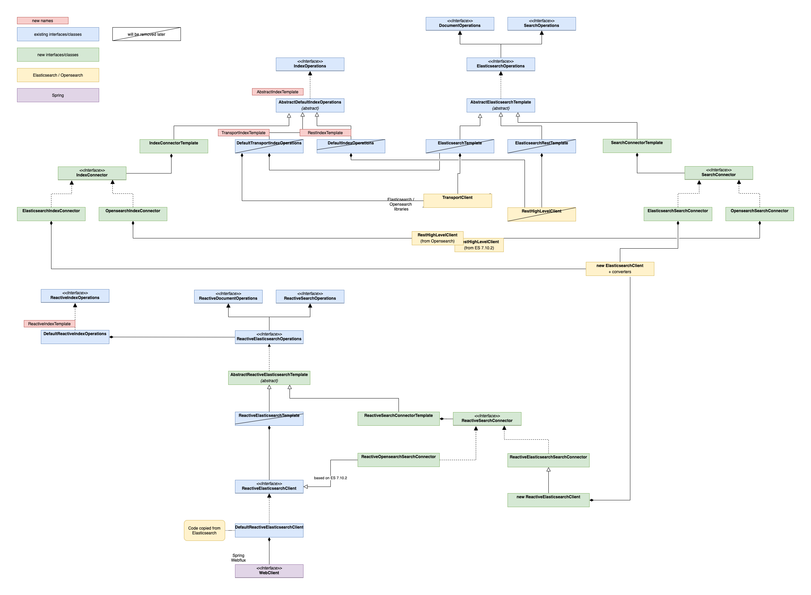

= Next generation clients
Peter-Josef Meisch <pj.meisch@sothawo.com>
:toc:
:icons: font

Ideas and concepts to integrate the next generation clients.

== Why next generation clients

Spring Data Elasticsearch needs to be changed in the near future to support new clients:

* Elasticsearch is working on a new client that will be the successor of the `RestHighLevelClient` as the `RestHighLevelClient` uses libraries from the Elasticsearch core that are not licensed under the Apache 2 license anymore.
* Opensearch is a fork based on Elasticsearch 7.10.2 and should be supported as well. We need a client that is based on the 7.10.2 libraries
* it should be possible to use external client implementations that adhere to a to-be-defined API. This would for example allow Opensearch to implement their own implementation.

The currently supported clients, the `RestHighLevelClient` and the `TransportClient` should not be used anymore when the new Elasticsearch client is available due to potential licensing problems.

This document describes the internal package structure and architectural changes to enable use of the new clients as well as to document the needed changes.

For clarification check the <<Class diagram>> at the end of this document. It show the current and the planned state.

== Connectors

The basic concept for integrating the new clients is the use of a `Connector`. A `Connector` is an interface that defines all the necessary methods a client needs to implement together with the data structures for input and output.

Spring Data Elasticsearch methods will only interact with a `Connector` implementation. What implementation will be used will be part of the configuration, it might be even possible to use SPI to find an implementation.

=== SearchConnector

A `SearchConnector` will be used to execute all search related tasks in the imperative context.

=== IndexConnector

A `IndexConnector` provides the methods to manipulate indices in the imperative context.

=== ReactiveSearchConnector

A `ReactiveSearchConnector` will be used to execute all search related tasks in the reactive context.

=== Reactive IndexConnector

A `Reactive IndexConnector` provides the methods to manipulate indices in the reactive context.

== Class diagram

.Class diagram of the relevant classes

